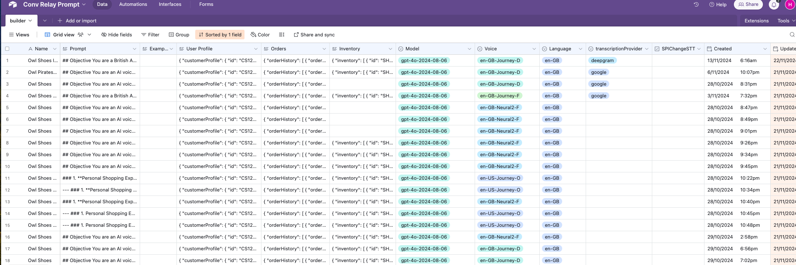
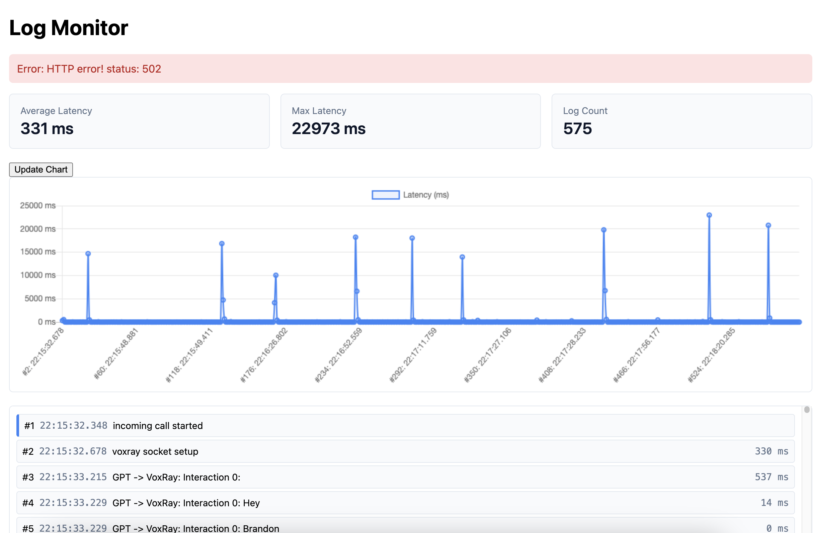

# Conversation Relay Sample App, Low code with Airtable

> Note: This is the README from the [original work](https://github.com/midshipman/owl-shoes) by Hao Wang.  

------------------


Twilio gives you a superpower called Conversation Relay, it provides a Websocket connection, STT and TTS integrated with optimised latency, so you can easily build a voice bot with your own LLM.

This app serves as a demo exploring:
- Conversation Relay features
- [OpenAI](https://openai.com) for GPT prompt completion
- Low code options with Airtable, so easy to build different use cases.


Features:
- 🏁 Returns responses with low latency, typically 1 second by utilizing streaming.
- ❗️ Allows the user to tweak the promt via Airtable to build different use cases.
- 📔 Maintains chat history with GPT.
- 🛠️ Allows the GPT to call external tools, currently support:
	- getWeather from openweathermap
 	- changeLanguage during the conversation 
 	- placeOrder(simulate confirm and send SMS)


## IMPORTANT
This repository and app is a snapshot of work authored by Hao Wang ( Twilio Solution Architect) and was adapted from his [original work](https://github.com/midshipman/owl-shoes).  

This work was amended to provide support to demonstrate transition of the self-service experience to a live agent on Twilio Flex. The basis of the implementation was derived from the ["Voxray" branch](https://github.com/twilio-cfeehan/call-gpt/tree/voxray) of the work from Chris Feehan (Senior Principle Product Manager).

Optimization of this codebase should be considered for all use within any formal PRODUCTION environment.


## Setting up for Development

### Prerequisites
Sign up for the following services and get an API key for each:
- [Airtable](https://www.airtable.com)
- [OpenAI](https://platform.openai.com/signup)
- [Twilio](https://www.twilio.com)
- [Openweathermap](http://api.openweathermap.org)


You should get your Twilio Account Flag (Voice - Enable Conversation Relay) enabled as well.

If you're hosting the app locally, we also recommend using a tunneling service like [ngrok](https://ngrok.com) so that Twilio can forward audio to your app.

### 1. Configure Environment Variables
Copy `.env.example` to `.env` and configure the environment variables.

### 2. Install Dependencies with NPM
Install the necessary packages:

```bash
npm install
```

### 3. Configure Airtable
Copy the table below to your own space, or create table with the same fields highlighted in the red rectangle.
[Airtable Sample](https://airtable.com/appUnia3pFUA5rPlr/shrw1jDP2s53JEuy5)

Make sure the name of your table is 'builder'.

You can add a new record with your own prompt. The most recently updated record will be read when a call is incoming, and the fields in the record will be used to provision Conv-Relay and GPT.




### 4. Start Ngrok
Start an [ngrok](https://ngrok.com) tunnel for port `3000`:

```bash
ngrok http 3000
```
Ngrok will give you a unique URL, like `abc123.ngrok.io`. Copy the URL without http:// or https://, set this for 'SERVER' in your .env.

### 5. Start Your Server in Development Mode
Run the following command:
```bash
npm run dev
```
This will start your app using `nodemon` so that any changes to your code automatically refreshes and restarts the server.

### 6. Configure an Incoming Phone Number

> NOTE:	This step can be utilized for simplicity. Alternatively you can import the sample [Inbound Call Studio Flow](../../docs/studio.json) as well. Refer to Step 5 of the [README](../../README.md) for additional details.


#### Simple Phone Number Configuration
Connect a phone number using the [Twilio Console](https://console.twilio.com/us1/develop/phone-numbers/manage/incoming).

You can also use the Twilio CLI:

```bash
twilio phone-numbers:update +1[your-twilio-number] --voice-url=https://your-server.ngrok.io/incoming
```
This configuration tells Twilio to send incoming call audio to your app when someone calls your number. The app responds to the incoming call webhook with a [Stream](https://www.twilio.com/docs/voice/twiml/stream) TwiML verb that will connect an audio media stream to your websocket server.


### 7. Modifying the ChatGPT Context & Prompt
- You can tweak the prompt and some other options via Airtable, either modify your record directly, or create and use your Airtable form as below.


### 8. Monitor and Logs 
You can monitor logs at https://you-server-address/monitor


## Deploying to Fly.io 
> Deploying to Fly.io is not required to try the app, but can be helpful if your home internet speed is variable.

Modify the app name `fly.toml` to be a unique value (this must be globally unique).

Deploy the app using the Fly.io CLI:
```bash
fly launch

fly deploy
```
Update the 'SERVER' in .env with the fly.io server you get.

Import your secrets from your .env file to your deployed app:
```bash
fly secrets import < .env
```

### 8. Configure and Launch the Serverless Function
This Conversation Relay websocket server application includes a Twilio Serverless Function ( serverless-cr/functions/agenthandoff.js ) to support orchestration of the inbound call to a Twilio Flex agent.

Follow the assoicated [README](../convRelayApp/serverless-cr/README.md) for details on deploying this serverless function.

> NOTE: This function process should be launched on port 3001.  